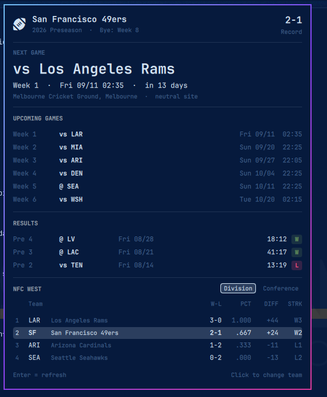

# NFL for the Omarchy shell

A bar widget for [Omarchy](https://omarchy.org/): a football glyph in the bar,
and a popup with the full season — schedule, live score, results and standings
— for **any of the 32 NFL teams**. Pick your team from a searchable list inside
the panel; no config file editing required.



## What the popup shows

| Section | Content |
|---|---|
| Header | Team, record, season and season phase, bye week. Click the team name to switch teams |
| Next game | Opponent, week, kickoff in local time, countdown, venue. While a game is on this becomes the live score with quarter and clock |
| Upcoming games | The next fixtures with date and kickoff time |
| Results | Games played, newest first, with final score and a win/loss badge |
| Standings | The team's division or its whole conference, switchable; your team's row is highlighted |

Preseason, regular season and postseason are merged into one chronological
list (`Pre 4`, `Week 12`, `Wild Card`, …), and bye weeks are derived from gaps
in the regular-season calendar.

## Install

```bash
omarchy plugin add https://github.com/Mario-Mohar/omarchy-nfl.git
omarchy plugin enable themo.nfl --section center
omarchy restart shell
```

The restart is required once: a newly enabled bar widget is not instantiated
into the bar by hot reload alone. After that, edits to the plugin files reload
automatically.

Requires `python3` — standard library only, no extra packages — plus `jq` if
you use the `install` script below. Omarchy ships both.

### Without a network, or from a copy

If the folder arrives on a USB stick or as a download rather than through
`omarchy plugin add`, run the bundled installer from inside it:

```bash
./install                              # center section, then restart the shell
./install --section right --team kc    # place and preselect in one go
./install --yes --no-restart           # unattended
```

It copies the folder to `~/.config/omarchy/plugins/themo.nfl`, validates it
against Omarchy's manifest schema, adds it to the bar and restarts the shell.
Re-running it upgrades in place: the old copy is moved to
`~/.config/omarchy/nfl/backups/`, and an existing bar entry is left alone so
placement and settings survive.

`./uninstall` removes the plugin, its bar entry and the cached ESPN payloads.

## Choosing a team

Click the team name in the panel header, type to filter (`ka` → Kansas City,
`49` → San Francisco, `york` → both New York teams), then `Enter`. The choice is
stored in `~/.local/state/omarchy/nfl-team.json` and survives restarts.

You can also set a starting team in `shell.json`:

```json
{ "id": "themo.nfl", "team": "kc" }
```

The picker's choice takes precedence over that setting. To hand control back to
it, clear the stored team:

```bash
~/.config/omarchy/plugins/themo.nfl/bin/nfl-team --clear
```

All 32 ESPN abbreviations work: `ari atl bal buf car chi cin cle dal den det
gb hou ind jax kc lac lar lv mia min ne no nyg nyj phi pit sea sf tb ten wsh`.

## Controls

| Action | Effect |
|---|---|
| Left click | Open/close the popup |
| Middle click | Reload now, bypassing the cache |
| Click team name | Open the team picker |
| `↑` `↓` `Enter` `Esc` | Navigate, confirm, cancel in the picker |
| `Enter` (popup open) | Reload |
| `Esc` | Close |
| `Division` / `Conference` | Switch the standings scope |

IPC lives on the `themo.nfl.control` target:

```bash
omarchy-shell themo.nfl.control open|close|toggle|refresh|pickTeam
omarchy-shell themo.nfl.control setTeam KC
```

Handy as a Hyprland binding:

```lua
o.bind("SUPER SHIFT", "N", "Toggle NFL", "omarchy-shell themo.nfl.control toggle")
```

## Settings

In `~/.config/omarchy/shell.json`, on the `{"id": "themo.nfl"}` entry:

| Key | Default | Meaning |
|---|---|---|
| `team` | `sf` | ESPN team abbreviation; the in-panel picker overrides it |
| `barFormat` | `icon` | `icon`, `short` (`@ LV`), `next` (`@ LV Fri 08/28 02:00`), `record`, `last` |
| `refreshMinutes` | `15` | Poll interval; drops to 1 minute while a game is live |
| `upcomingCount` | `6` | Upcoming games listed; `0` hides the section |
| `resultsCount` | `8` | Results listed; `0` hides the section |
| `standingsScope` | `division` | Standings view on open |
| `icon` | `` | Bar glyph |
| `winColor` | `#6f9e5f` | Win badge color; losses use the theme's `urgent` |

Example:

```json
{ "id": "themo.nfl", "team": "kc", "barFormat": "short", "resultsCount": 12 }
```

`barFormat: icon` uses the bar's narrow icon slot. The text variants render in
a button that grows with its label, so they never overlap neighbouring widgets.

## Data

`bin/nfl-data` queries ESPN's public API and reduces the three schedule
responses (season types 1/2/3) plus the standings into one compact document
(~17 KB instead of ~700 KB) that the QML side reads directly. No API key, no
account, no third-party service.

```bash
bin/nfl-data --team sf              # cached, max 900 s old
bin/nfl-data --team kc --no-cache   # force a fresh fetch
bin/nfl-data --teams                # the 32-team roster for the picker
```

Caches live in `~/.local/state/omarchy/`: `nfl-<team>.json` per team, and
`nfl-teams.json` for the roster (refreshed weekly). If a fetch fails, the last
good payload is served so the popup never goes blank; the picker additionally
falls back to a roster baked into the script, so it works offline.

That directory is opened once and every read and write happens relative to that
descriptor, never through a path a second time: the helpers refuse a state
directory owned by somebody else or writable by others, refuse a symlink where
a cache file should be, write through randomly named exclusive temporary files
at mode 600, and cap how much they will read from the network or from the cache
before parsing it. Files land at `-rw-------`.

Two things worth knowing if you hack on this:

- ESPN answers browser-like User-Agents with `403`. The script identifies as
  `curl/8.7.1`, which is accepted.
- The bar glyph is `nf-fa-football` (`U+ED69`). The Material Design
  `U+F023A` that looks like the obvious choice is a *fish*, and several
  football-ish glyphs turn to mush at the bar's 13 px.

## Credits

Data by [ESPN](https://www.espn.com/) via their public, unauthenticated API.
This project is not affiliated with, endorsed by or connected to ESPN or the
National Football League.

## License

[MIT](LICENSE)
